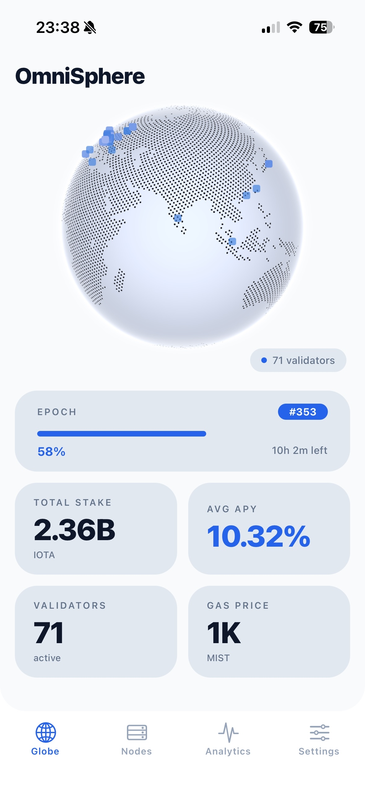
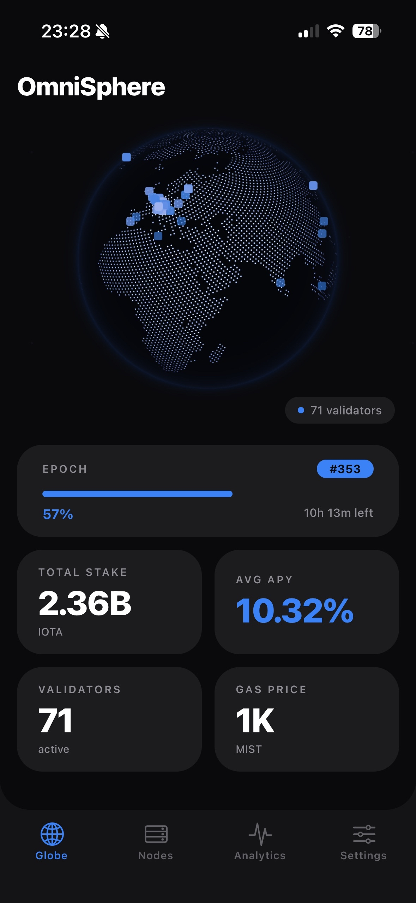
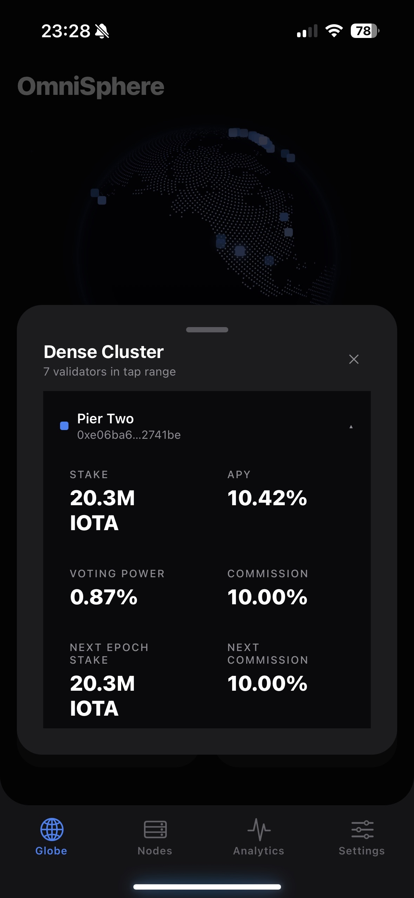
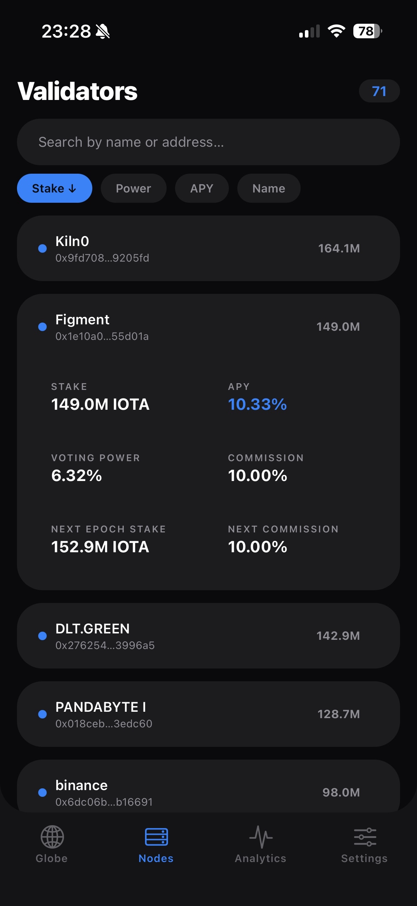
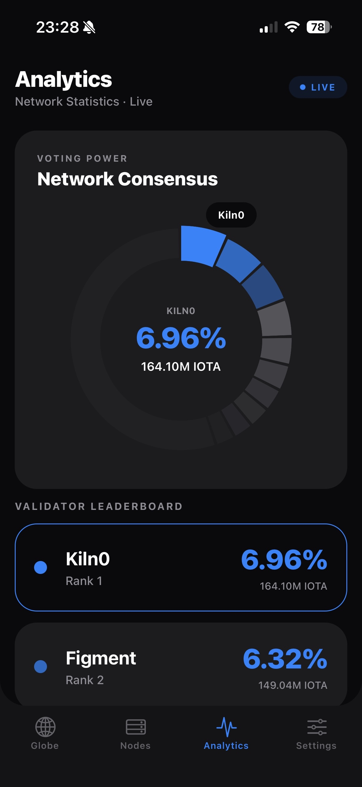
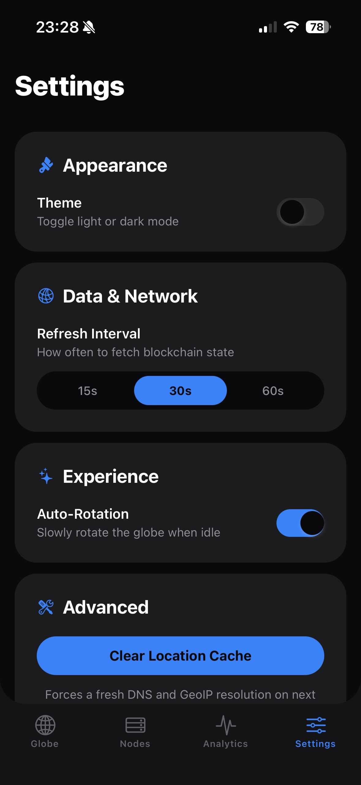

# OmniSphere

OmniSphere is a cross-platform React Native application for exploring the IOTA validator ecosystem through an interactive 3D globe, live network metrics, validator analytics, and configurable runtime behavior.

Built with Expo + Expo Router, the app runs on iOS, Android, and web from one codebase.

## Table of contents

- [Overview](#overview)
- [Core features](#core-features)
- [Tech stack](#tech-stack)
- [Project structure](#project-structure)
- [Data flow](#data-flow)
- [Getting started](#getting-started)
- [Configuration](#configuration)
- [Available scripts](#available-scripts)
- [Caching and refresh behavior](#caching-and-refresh-behavior)
- [Troubleshooting](#troubleshooting)
- [Development notes](#development-notes)

## Overview

OmniSphere focuses on operational visibility of the validator network:

- A performant 3D globe experience with validator markers and selection overlays.
- A compact dashboard for epoch and stake health signals.
- A validators tab for deep sorting, filtering, and metric inspection.
- An analytics tab for voting power distribution and APY comparisons.
- A settings system for theme, auto-rotation, refresh interval, and cache management.

## Screenshots

<div style="display: flex; flex-direction: row; flex-wrap: wrap; gap: 10px;">
  
  
  
  
  
  
</div>

## Core features

### 3D globe experience

- COBE-based globe rendered inside a WebView/iframe bridge.
- Real-time marker projection with selection support.
- Single-validator and multi-validator overlay cards.
- Gesture support: drag, momentum, pinch-to-zoom, tap-to-select.

### Network dashboard

- Epoch progress and remaining time.
- Total stake, average APY, active validator count, and gas price.
- Live refresh driven by React Query and user-configurable intervals.

### Validators workspace

- Search by name/address.
- Sort by stake, voting power, APY, or name.
- Expandable metric cards per validator.

### Analytics workspace

- Interactive voting power donut visualization.
- Validator leaderboard cards.
- APY carousel for high-yield comparison.
- Pull-to-refresh support.

### Operational settings

- Light and dark themes.
- Configurable refresh interval (15s / 30s / 60s).
- Auto-rotation control for the globe.
- Clear geolocation cache action.

## Tech stack

- React Native 0.81 + React 19
- Expo SDK 54
- Expo Router (file-based navigation and API routes)
- @tanstack/react-query for data fetching and caching
- react-native-webview for native globe rendering
- COBE for 3D globe rendering
- TypeScript (strict mode)
- ESLint (expo flat config)

## Project structure

```text
app/
   _layout.tsx                 # Root providers, navigation stack, boot animation
   api/validators+api.ts       # Internal API proxy to IOTA RPC
   (tabs)/
      _layout.tsx               # Tab navigation and custom tab bar styling
      index.tsx                 # Home: globe + dashboard
      validators.tsx            # Validator explorer
      analytics.tsx             # Network analytics
      settings.tsx              # Runtime configuration

components/
   globe/                      # Globe, overlays, WebView bridge, HTML scripts
   dashboard/                  # Network summary cards
   social/                     # Optional X feed WebView component

hooks/
   use-validators.ts           # React Query hook for validator payload
   use-validator-locations.ts  # Geolocation resolution query
   use-settings.tsx            # Persistent UI/runtime settings

services/
   api/client.ts               # Internal API fetch wrapper
   validators.ts               # Validators service contracts
   validator-location/         # DNS + GeoIP resolution and cache layer

utils/
   spherical-hash.ts           # Deterministic fallback coordinates
```

## Data flow

1. UI requests validator data through `useValidators`.
2. Client calls internal route `GET /api/validators`.
3. API route proxies two RPC methods in parallel:
   - `iotax_getLatestIotaSystemStateV2`
   - `iotax_getValidatorsApy`
4. Geolocation pipeline resolves validator hosts to IPv4 and GeoIP coordinates.
5. Globe bridge pushes normalized marker payloads to the WebView renderer.

## Getting started

### Prerequisites

- Node.js LTS (18+ recommended)
- npm (bundled with Node)
- For simulators/emulators:
  - Android Studio (Android)
  - Xcode (iOS, macOS only)

### Install dependencies

```bash
npm install
```

### Start the development server

```bash
npm run start
```

Then choose one of the Expo targets:

- Android emulator/device
- iOS simulator/device
- Web

### Platform-specific shortcuts

```bash
npm run android
npm run ios
npm run web
```

## Configuration

### IOTA RPC endpoint

The app reads the RPC URL from `app.json`:

```json
{
  "expo": {
    "extra": {
      "iotaRpcUrl": "https://api.mainnet.iota.cafe"
    }
  }
}
```

Notes:

- API route enforces secure endpoints (`https://` / `wss://`).
- If the endpoint is unavailable, the app surfaces a connection error state.

## Available scripts

| Script            | Description                   |
| ----------------- | ----------------------------- |
| `npm run start`   | Start Expo development server |
| `npm run android` | Launch Android target         |
| `npm run ios`     | Launch iOS target             |
| `npm run web`     | Launch web target             |
| `npm run lint`    | Run ESLint checks             |

## Caching and refresh behavior

### React Query

- Validator query refresh interval is user-configurable via Settings.
- Query retries with exponential backoff on transient failures.

### Geolocation cache

- Domain -> IP and IP -> geo mappings are cached.
- Web: localStorage-backed cache.
- Native: file-backed cache (Expo file system).
- Cache can be cleared from the Settings screen.

## Troubleshooting

### "Connection Failed" on Home/Analytics

- Verify internet access to the configured IOTA RPC endpoint.
- Ensure endpoint is HTTPS/WSS.
- Confirm the API route returns valid JSON.

### Validators are missing geolocation

- Some validators may not expose resolvable host data.
- In unresolved cases, deterministic fallback coordinates may be used.
- Use "Clear Location Cache" in Settings to force a fresh resolution cycle.

### X feed shows rate limit

- The embedded X timeline can return temporary 429/rate-limit responses.
- Use the fallback action in the UI to open the feed directly on X.

## Development notes

- TypeScript strict mode is enabled.
- Alias `@/*` maps to the repository root.
- Expo Router typed routes are enabled.
- New architecture is enabled in Expo config.

---

If you are onboarding to the project, start with:

1. `app/_layout.tsx`
2. `app/(tabs)/index.tsx`
3. `components/globe/`
4. `app/api/validators+api.ts`
